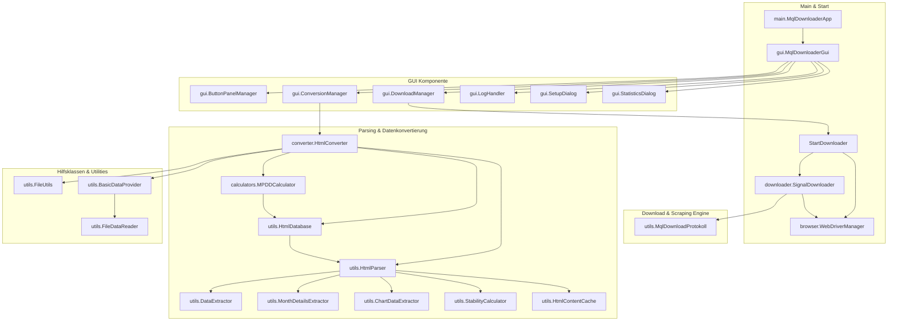

# MqlDownloader – System- und Architekturdokumentation

Dieses Dokument beschreibt die Architektur, die internen Abläufe und die Algorithmen der Java-Desktop-Anwendung **MqlDownloader**.

---

## 📊 1. Projektübersicht & Zweck

**MqlDownloader** ist eine hochspezialisierte Desktop-Anwendung zur automatisierten Extraktion, Analyse und Bewertung von MetaTrader 4 (MQL4) und MetaTrader 5 (MQL5) Signal-Providern direkt von der MQL5-Community.

Das Hauptziel der Anwendung ist die **systematische Filterung und Risikobewertung** von Signal-Providern für algorithmischen Handel und Portfolio-Management. Kernstücke des Tools sind:
- **Selenium-basiertes Web-Scraping** unter Umgehung typischer Browser-Sperren.
- **Automatisierte Qualitätsprüfung** mittels des risikoadjustierten **MPDD-Algorithmus** (Month Profit Divided by Drawdown).
- **Automatisches Daten-Cleanup**, das ungeeignete Signale (MPDD < 0.5) sofort von der Festplatte löscht, um Speicherplatz und Rechenzeit bei Folgeschritten (z. B. Backtesting) zu sparen.

---

## 🏗️ 2. Architektur & Paket-Struktur

Die Software ist modular aufgebaut und trennt die GUI, die Browser-Steuerung, die Parser-Logik, die mathematischen Berechnungen sowie die Konfiguration voneinander.

### Komponenten-Übersicht (Mermaid)



---

## 📁 3. Detaillierte Paket- und Klassenbeschreibung

### 3.1. Default-Paket
- **[StartDownloader.java](file:///d:/git/MQL/MqlDownloader/src/StartDownloader.java)**:
  Die zentrale Steuerungsklasse für den Headless-Betrieb und CLI-Modus (z. B. über den Parameter `autostart`). Sie initialisiert den `WebDriverManager`, lädt die Zugangsdaten und startet den `SignalDownloader`. Enthält zudem Methoden zur Systemgesundheitsprüfung (`isSystemHealthy()`) und zur automatischen WebDriver-Wiederherstellung (`restartWebDriver()`).

### 3.2. Paket `main`
- **[MqlDownloaderApp.java](file:///d:/git/MQL/MqlDownloader/src/main/MqlDownloaderApp.java)**:
  Der Haupteinstiegspunkt für die GUI-Version der Anwendung. Sie stellt die Ordnerstrukturen unter `C:\Forex\MqlAnalyzer` über den `ConfigurationManager` sicher, konfiguriert Log4j2 und startet die Swing-Oberfläche.

### 3.3. Paket `config`
- **[ConfigurationManager.java](file:///d:/git/MQL/MqlDownloader/src/config/ConfigurationManager.java)**:
  Verwaltet alle Pfade, URLs und Properties. Die Einstellungen werden persistent in `C:\Forex\MqlAnalyzer\config\MqldownloaderConfig.txt` gesichert. Hierzu zählen MQL4- und MQL5-Scrapinglimits, Wartezeiten (Min/Max Delay) und Zugangsdaten.
- **[Credentials.java](file:///d:/git/MQL/MqlDownloader/src/config/Credentials.java)**:
  Einfache Datenklasse zur Kapselung von MQL5-Community-Benutzernamen und Passwörtern.

### 3.4. Paket `browser`
- **[WebDriverManager.java](file:///d:/git/MQL/MqlDownloader/src/browser/WebDriverManager.java)**:
  Steuert die Chrome-Instanz über Selenium. 
  * **Besonderheit**: Um Browser-Konflikte zu vermeiden, wird für jede Session ein einzigartiges temporäres Profil-Verzeichnis (`user-data-dir`) erzeugt. Sie verfügt über eine automatische Crash-Erkennung mit automatischem Retry (max. 3 Versuche) und einem Windows-spezifischen Chrome-Prozess-Cleanup (`taskkill`).

### 3.5. Paket `downloader`
- **[SignalDownloader.java](file:///d:/git/MQL/MqlDownloader/src/downloader/SignalDownloader.java)**:
  Der Kern-Scraper. Navigiert über die Signal-Listenseiten von MQL, liest die Tabellen der Signal-Provider aus, klickt sich auf die Unterseiten der Provider, speichert das HTML-Dokument (`_root.html`) und stößt den Download der CSV-Transaktionshistorie an.
- **[ProgressCallback.java](file:///d:/git/MQL/MqlDownloader/src/downloader/ProgressCallback.java)**:
  Interface für Fortschritts-Callbacks an die GUI.

### 3.6. Paket `converter`
- **[HtmlConverter.java](file:///d:/git/MQL/MqlDownloader/src/converter/HtmlConverter.java)**:
  Orchestriert das Konvertieren der rohen HTML-Scrapes in bereinigte, strukturierte `.txt`-Dateien. Führt direkt während des Lesens das **MPDD-Filtering** durch. Falls der berechnete 3MPDD-Wert kleiner als 0,5 ist, werden alle zugehörigen Dateien (`.html`, `.csv`, `_root.txt`) gelöscht und der Vorfall in der Datei `conversionLog.txt` dokumentiert. Bei Fehlern während des Parsens/Konvertierens einer Datei wird diese ebenfalls automatisch gelöscht und protokolliert, damit der Gesamtprozess nicht blockiert wird.
- **[ConversionProgress.java](file:///d:/git/MQL/MqlDownloader/src/converter/ConversionProgress.java)**:
  Fortschritts-Callback-Interface für Konvertierungsaufgaben.

### 3.7. Paket `calculators`
- **[MPDDCalculator.java](file:///d:/git/MQL/MqlDownloader/src/calculators/MPDDCalculator.java)**:
  Berechnet risikoadjustierte Leistungswerte. Nutzt die Schnittstelle `HtmlDatabase`, um monatliche Gewinne und Drawdowns abzurufen, und berechnet wahlweise 3-, 6-, 9- oder 12-Monats-MPDD.

### 3.8. Paket `gui`
- **[MqlDownloaderGui.java](file:///d:/git/MQL/MqlDownloader/src/gui/MqlDownloaderGui.java)**:
  Hauptfenster der Swing-Anwendung mit Log-Bereich (Terminal-Style), Fortschrittsbalken und Menüzeile.
- **[DownloadManager.java](file:///d:/git/MQL/MqlDownloader/src/gui/DownloadManager.java)** / **[ConversionManager.java](file:///d:/git/MQL/MqlDownloader/src/gui/ConversionManager.java)**:
  Verwalten die Thread-Ausführung der Scraping- und Konvertierungsprozesse, um die GUI reaktionsfähig zu halten.
- **[ButtonPanelManager.java](file:///d:/git/MQL/MqlDownloader/src/gui/ButtonPanelManager.java)**:
  Stellt Layouts für Eingabefelder und Steuerungsschaltflächen bereit.
- **[LogHandler.java](file:///d:/git/MQL/MqlDownloader/src/gui/LogHandler.java)**:
  Leitet Log-Ausgaben formatiert und farbcodiert in die GUI-Textarea um.
- **[SetupDialog.java](file:///d:/git/MQL/MqlDownloader/src/gui/SetupDialog.java)**:
  Einstellungsfenster für Pfade und Verbindungsdaten.
- **[StatisticsDialog.java](file:///d:/git/MQL/MqlDownloader/src/gui/StatisticsDialog.java)**:
  Ein Analyse-Fenster, das die Altersstruktur der heruntergeladenen Dateien visualisiert.

### 3.9. Paket `utils`
- **[HtmlParser.java](file:///d:/git/MQL/MqlDownloader/src/utils/HtmlParser.java)**:
  Fassade, die den Zugriff auf die spezialisierten Extraktoren kapselt.
- **[DataExtractor.java](file:///d:/git/MQL/MqlDownloader/src/utils/DataExtractor.java)**:
  Extrahiert finanzielle Kennzahlen wie Balance, Equity und Text-Drawdown via Regex aus HTML. Schlägt die Extraktion fehl (z. B. bei unvollständigen Downloads), wird eine Exception geworfen und die unvollständigen Dateien direkt gelöscht (anstelle eines zuvor verwendeten interaktiven Bestätigungsdialogs).
- **[MonthDetailsExtractor.java](file:///d:/git/MQL/MqlDownloader/src/utils/MonthDetailsExtractor.java)**:
  Interpretiert die monatlichen Renditetabellen des Signal-Providers.
- **[ChartDataExtractor.java](file:///d:/git/MQL/MqlDownloader/src/utils/ChartDataExtractor.java)**:
  Analysiert die eingebetteten SVG-Drawdown-Grafiken im HTML-Dokument und übersetzt die Pfad-Koordinaten in Zeitreihen-Punkte (`ChartPoint`).
- **[StabilityCalculator.java](file:///d:/git/MQL/MqlDownloader/src/utils/StabilityCalculator.java)**:
  Berechnet eine mathematische Qualitätsmetrik für die Stetigkeit der monatlichen Erträge.
- **[FileUtils.java](file:///d:/git/MQL/MqlDownloader/src/utils/FileUtils.java)**:
  Unterstützt Dateisystemoperationen (z. B. Rekursives Löschen, Ordnerbereinigungen).
- **[MqlDownloadProtokoll.java](file:///d:/git/MQL/MqlDownloader/src/utils/MqlDownloadProtokoll.java)**:
  Schreibt detaillierte Transaktionsprotokolle (`mql4download.txt` / `mql5download.txt`) für alle Scraper-Aktivitäten.
- **[FileStatistics.java](file:///d:/git/MQL/MqlDownloader/src/utils/FileStatistics.java)**:
  Gruppiert und zählt das Alter der lokalen XML-/HTML-Dateien.

---

## 📈 4. Kernalgorithmen

### 4.1. MPDD (Month Profit Divided by Drawdown)

Die Kernkennzahl MPDD wird zur Risikobewertung herangezogen. Sie setzt den durchschnittlichen monatlichen Gewinn ins Verhältnis zum maximalen Drawdown.

#### Die mathematische Formel:

$$\text{MPDD}_n = \frac{\text{Durchschnittlicher Profit der letzten } n \text{ Monate}}{\text{Maximaler Equity Drawdown}}$$

Dabei gelten folgende Berechnungsregeln im Code (`MPDDCalculator.java`):
1. **Ausschluss des aktuellen Monats**: Um Verzerrungen durch angebrochene Monate zu vermeiden, wird der laufende Monat ignoriert.
2. **Besonderheit bei 3-Monats-MPDD (3MPDD)**: 
   Hier genügt bereits mindestens **1 historischer Monat** (neben dem aktuellen Monat). Sind weniger als 3 Monate verfügbar, wird der Durchschnitt über die tatsächlich verfügbaren Monate (1 oder 2) gebildet.
3. **Regel bei 6, 9 & 12-Monats-MPDD**:
   Diese Metriken werden nur berechnet, wenn die Historie mindestens $n + 1$ Monate (inklusive des aktuellen Monats) umfasst. Andernfalls wird der Wert auf `0.0` gesetzt.
4. **Schutz vor Division durch Null**: Ist der Drawdown kleiner oder gleich $0.0$, wird standardmäßig mit $1.0\%$ gerechnet.

> [!IMPORTANT]
> **Das Qualitäts-Limit von 0.5:**
> Während des Konvertierungsprozesses prüft `HtmlConverter` den berechneten **3MPDD-Wert**. Liegt dieser **unter 0.5**, wird das Signal verworfen. Sämtliche zugehörigen Scraped-Dateien des Signal-Provider-Ids (HTML-Rohdaten, CSV-Historie, TXT-Zusammenfassung) werden physikalisch gelöscht.

---

### 4.2. Stabilitätsberechnung (Stability Score)

Der Stabilitätswert misst die Gleichmäßigkeit der monatlichen Performance der letzten 3 Monate und wird im `StabilityCalculator` berechnet.

#### Berechnungsschritte:
1. Extraktion der Profitwerte (in %) der letzten 3 abgeschlossenen Monate.
2. Berechnung des arithmetischen Mittelwerts ($\mu$) der Gewinne.
3. Berechnung der Standardabweichung ($\sigma$) der Gewinne:
   $$\sigma = \sqrt{\frac{1}{k}\sum_{i=1}^{k} (v_i - \mu)^2}$$
4. Bestimmung der relativen Standardabweichung (Variationskoeffizient):
   $$\text{Relative StdDev} = \frac{\sigma}{|\mu| + 0.0001}$$
5. Berechnung der Basis-Stabilität:
   $$\text{Basis-Stabilität} = \max(1.0, 100 \cdot (1 - \text{Relative StdDev}))$$
6. Skalierung anhand der Datenqualität:
   * Wenn weniger als 3 Monate zur Verfügung stehen, verringert sich der Stabilitätswert über den Faktor:
     $$\text{Qualitätsfaktor} = \frac{\text{Anzahl gefundener Monate}}{3}$$
   * Der finale Stabilitätswert errechnet sich als:
     $$\text{Stabilitätswert} = \max(1.0, \min(100.0, \text{Basis-Stabilität} \cdot (0.7 + 0.3 \cdot \text{Qualitätsfaktor})))$$

---

## 💾 5. Verzeichnisstrukturen & Datenfluss

Die Anwendung organisiert ihre Konfigurations- und Ergebnisdateien in einem dedizierten Root-Verzeichnis. Standardmäßig ist dies `C:\Forex\MqlAnalyzer`.

### 5.1. Struktur im Dateisystem

```
C:\Forex\MqlAnalyzer\
├── config\
│   └── MqldownloaderConfig.txt          # Zentrale Key-Value-Konfiguration
├── logs\
│   └── MqlDownloader.log                # Anwendungs-Logfile (Log4J2)
└── download\
    ├── conversionLog.txt                # Protokoll über alle durchgeführten HTML->TXT Konvertierungen
    ├── mql4download.txt                 # Downloadprotokoll für MT4-Signale
    ├── mql5download.txt                 # Downloadprotokoll für MT5-Signale
    ├── mql4\                            # Ergebnisse für MetaTrader 4
    │   ├── ProviderName_SignalID_root.html   # Heruntergeladene Originalseite
    │   ├── ProviderName_SignalID.csv         # Handelsverlauf (CSV)
    │   └── ProviderName_SignalID_root.txt    # Bereinigte Kennzahlen & Analyseergebnisse
    └── mql5\                            # Ergebnisse für MetaTrader 5
        ├── ProviderName_SignalID_root.html
        ├── ProviderName_SignalID.csv
        └── ProviderName_SignalID_root.txt
```

---

### 5.2. Format der extrahierten Kennzahlen (`_root.txt`)

Die erzeugten `_root.txt`-Dateien dienen als strukturierte Key-Value-Datenbank für weiterführende Auswertungen. Sie weisen folgendes Format auf:

```properties
Balance=15420.50
MaxDDGraphic=12.34
EquityDrawdown=12.34
Average3MonthProfit=6.13
StabilityValue=85.40
MonthProfitProz=2026/04=5.2,2026/03=3.1,2026/02=7.8,2026/01=11.2
DrawdownPoints=[2026-02-15=2.1; 2026-03-20=4.5; 2026-04-10=12.34]
********************************
[Detaillierter Berechnungsbericht und Stabilitätsdetails in Textform]
```

---

## ⚡ 6. Mechanismen zur Scraping-Robustheit

Da MQL5 Schutzmechanismen gegen automatisiertes Scraping besitzt, nutzt der Downloader spezielle Techniken zur Stabilitätssicherung:

1. **User-Agent & Window Spoofing**: Der WebDriver setzt typische Desktop-User-Agents und deaktiviert Automatisierungshinweise.
2. **Ressourcenschonendes Headless-Setup**: Laden von Bildern, JavaScript-Modulen (soweit nicht notwendig) und Plugins wird blockiert, um CPU und Arbeitsspeicher zu entlasten.
3. **Randomized Wait Time**: Zwischen Anfragen wird eine zufällige Wartezeit (`getRandomWaitTime()`) zwischen den konfigurierten Werten (Standard: 4 bis 30 Sekunden) eingelegt.
4. **WebDriver Recovery**: Falls der Chrome-Browser abstürzt oder die Verbindung verliert, kann der `WebDriverManager` eine bestehende Session beenden, Reste säubern (`taskkill`) und den Scraper nahtlos an der letzten Position fortsetzen.
5. **Download Days**: Einstellbare Lebensdauer für die lokalen Downloads. Dateien, die älter als diese Tage sind, werden automatisch aktualisiert.

---

## 🛠️ 7. Installation & Entwicklung

### Systemanforderungen:
- **Java SE Development Kit (JDK) 11** oder höher.
- **Google Chrome** installiert auf dem System.
- **Maven** zum Auflösen der Abhängigkeiten.

### Wichtige Maven-Abhängigkeiten (`pom.xml`):
- `selenium-java` (Web-Automatisierung)
- `webdrivermanager` (Automatisches ChromeDriver-Handling)
- `jsoup` (HTML-Dokumentanalyse)
- `log4j-api` & `log4j-core` (Protokollierung)
